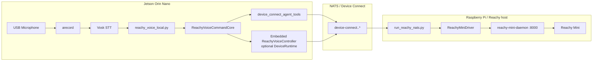

# Reachy Mini Voice Demo

This demo extends the Reachy controller branch with a voice-driven control path.
The preferred demo flow keeps speech-to-text local on the Jetson and sends
Reachy RPCs directly over Device Connect. The local runner can now either stay
client-only or register itself as a Device Connect controller so it appears in
discovery. An optional standalone `ReachyVoiceController` remains available for
event-driven topologies.

## Demo Modes

### 1. Local voice pipeline (recommended for the demo)

- `reachy_voice_local.py` runs on the Jetson Orin Nano
- `arecord` captures audio from the USB microphone
- Vosk turns audio into text locally
- `ReachyVoiceCommandCore` parses phrases such as `look left` and
  `he looked left by seven degrees`
- In client-only mode, Device Connect agent tools invoke Reachy RPCs on the
  registered robot device

### 2. Registered local voice pipeline (recommended when you want discovery)

- The same `reachy_voice_local.py` process starts an embedded
  `ReachyVoiceController` runtime when `--device-id` and `--tenant` are passed
- The Jetson voice process appears in mesh/discovery as its own controller device
- Local transcripts are fed directly into the embedded controller
- The controller invokes Reachy RPCs on the registered robot device

### 3. Voice controller device (optional)

- `reachy_voice_controller.py` runs as its own Device Connect device
- It listens for `voiceCommandCaptured` events from an external voice capture
  service
- It uses the same shared parser/execution core as the local pipeline

## Components

| Component | File | Role |
|---|---|---|
| Shared command interpreter | `reachy_voice_core.py` | Normalizes transcripts, maintains pose state, maps voice phrases to Reachy RPCs |
| Device Connect voice controller | `reachy_voice_controller.py` | Optional event-driven controller device that forwards parsed commands to Reachy |
| Local voice runner | `reachy_voice_local.py` | Mic -> Vosk -> transcript log -> direct Reachy control, optionally with embedded controller registration |
| Reachy robot device | `reachy_mini_driver.py` | Exposes `look`, `antennas`, `nod`, `shake`, and related RPCs |
| Reachy Pi sidecar | `run_reachy_nats.py` in `reachy_device_connect/` | Bridges the local Reachy daemon into Device Connect over NATS |
| Reachy daemon | `reachy-mini-daemon` | Owns `/api/daemon/status` and `/ws/sdk` on the Reachy host |

## Architecture



## End-to-End Demo Flow

1. Start the Reachy daemon on the Raspberry Pi or confirm the browser-control
   stack already owns `127.0.0.1:8000`.
2. Start the Reachy Device Connect sidecar on the Raspberry Pi with the
   commissioned Reachy device credentials.
3. Start the local voice runner on the Jetson with the controller credentials
   and a Vosk model path.
4. Optionally pass `--device-id` and `--tenant` if you want the Jetson voice
   process to appear as a controller device in discovery.
5. Speak commands such as `look left`, `look right`, or `look left by seven degrees`.
6. Watch the Jetson print `[final] ...` and `[command] ...` lines as the robot
   moves.

## Jetson Command

### Client-only mode

```bash
cd ~/workplace/robots

export MESSAGING_BACKEND=nats
export NATS_URL='nats://137.184.86.16:4222'
export NATS_CREDENTIALS_FILE='/home/sourav/workplace/robots/souravpati-controller-001.creds.json'
export DEVICE_CONNECT_ALLOW_INSECURE=true
export TENANT='souravpati'

./.venv/bin/python strands_robots/device_connect/reachy_voice_local.py \
  --model-path ~/workplace/robots/models/vosk-model-small-en-us-0.15 \
  --alsa-device plughw:0,0 \
  --target-device-id souravpati-reachy-mini-1 \
  --log-partials
```

### Registered controller mode

Use this when you want the Jetson voice process to appear in the mesh:

```bash
cd ~/workplace/robots

export MESSAGING_BACKEND=nats
export NATS_URL='nats://137.184.86.16:4222'
export NATS_CREDENTIALS_FILE='/home/sourav/workplace/robots/souravpati-controller-001.creds.json'
export DEVICE_CONNECT_ALLOW_INSECURE=true
export TENANT='souravpati'

./.venv/bin/python strands_robots/device_connect/reachy_voice_local.py \
  --model-path ~/workplace/robots/models/vosk-model-small-en-us-0.15 \
  --alsa-device plughw:0,0 \
  --device-id souravpati-voice-controller-001 \
  --tenant souravpati \
  --nats-url 'nats://137.184.86.16:4222' \
  --nats-credentials-file '/home/sourav/workplace/robots/souravpati-controller-001.creds.json' \
  --target-device-id souravpati-reachy-mini-1 \
  --log-partials
```

## Raspberry Pi Sidecar Command

```bash
cd /home/pi/aifabric/reachy_device_connect
source .venv/bin/activate

export MESSAGING_BACKEND=nats
export NATS_URL='nats://137.184.86.16:4222'
export TENANT='souravpati'
export DEVICE_ID='souravpati-reachy-mini-1'
export NATS_CREDENTIALS_FILE='/home/pi/aifabric/reachy_device_connect/souravpati-reachy-mini-1.creds.json'
export DEVICE_CONNECT_ALLOW_INSECURE=true
export REACHY_HOST='127.0.0.1'
export REACHY_PORT='8000'
export REACHY_TRANSPORT_MODE='websocket'

./.venv/bin/python run_reachy_nats.py
```

## Recognized Phrases

- `look left`
- `look right`
- `look up`
- `look down`
- `yaw left`
- `yaw right`
- `pitch up`
- `pitch down`
- `roll left`
- `roll right`
- `look left by seven degrees`
- `yaw left by ten degrees`
- `center`
- `nod`
- `shake`
- `happy`

## Notes

- Vosk was chosen for the demo because it is light enough to run on the Jetson
  Orin Nano without the Whisper/CUDA setup overhead.
- The parser intentionally accepts observed Vosk transcript quirks such as
  `he looked left by seven degrees`.
- The local runner is not a Device Connect device; it only needs agent-side
  credentials and a reachable NATS broker when used in client-only mode.
- In registered mode, the same local runner spins up an embedded
  `ReachyVoiceController` so it appears in discovery without moving STT off the Jetson.
